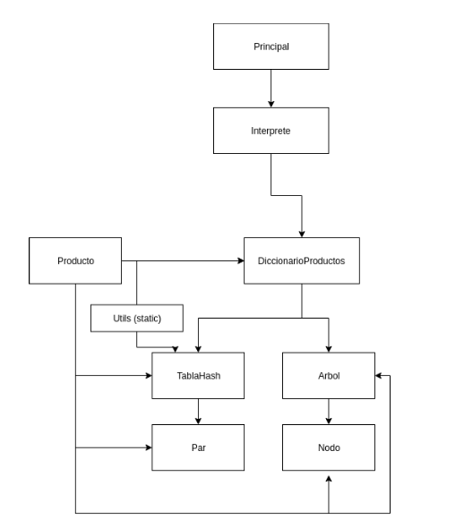
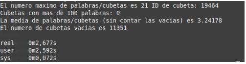

 

# Proyecto AED
Proyecto de Algoritmos y Estructuras de Datos para 2º de Ingenieria Informática.


Se trata de programar una "tienda online" de forma que se hagan consultas sobre ella de forma rápida y eficiente.

Este proyecto ha sido realizado por Enrique Rodriguez Lopez y Víctor Emilio Vicente.

# Compilar

```console
enrique@pc:~$ make
enrique@pc:~$ ./FastMarket
```

# Uso
Para poder hacer uso del programa, primero debemos insertar algunos productos.


## Insertar Productos
El sistema funciona por comandos. Este es el comando para insertar nuevos productos.

```console
insertar ID
Nombre producto
Descripcion producto
Precio
```

Ejemplo:

```console
insertar 80021349214
Monitor SONI 84''
Monitor Full HD de 84" con un precio INCREÍBLEMENTE CARO .
9999.95
```
## Consultar productos por precio
```console
precios MIN MAX
```
Ejemplo:
```console
precios 10 20
```
Esto por ejemplo mostrará por pantalla todos los productos cuyo precio esté en el rango de 10€-20€.
## Consultar productos por palabras clave
```console
palabras KEY1 KEY2 KEY3
```
Ejemplo:
```console
palabras HD MONITOR PRECIO
```
Deberida devolver todos los productos cuyo nombre o descripción contenga una de estas palabras clave.
## Eliminar produtos
```console
eliminar ID_PROD
```
Esto eliminará inmediatamene el producto que corresponda con dicho ID.
## Consultar por ID
```console
producto ID_PROD
```
Esto devolverá la información de un producto en concreto.

# Rendimiento
El objetivo principal de la práctica era hacer que el sistema fuera eficiente aun con entradas de datos enormes.

Debia de ser rápido tanto para insertar como para hacer las diferentes consultas.

Para ello se utilizan principalmente dos estructuras.

- Tablas hash: Para hacer las consultas por palabras eficientes. Tabla de dispersión abierta.
- Arboles: Para hacer las consultas por precios eficientes, usando arboles AVL.

 

Finalmente, estos son los resultados obtenidos.

| Operación                 | Tiempo de ejecución |
|---------------------------|---------------------|
| Consultar producto por ID | O(n)                |
| Eliminar producto por ID  | O(n)                |
| Insertar producto         | O(log n)            |
| Buscar por palabras       | O(1)                |
| Buscar por precios        | O(log n)            |

Hemos hecho tambien experimentación real de como es la dispersión en las tablas de HASH, obteniendo estadisticas sobre como se estaban utilizando para minimizar eñ tiempo de ejecución promedio.

 